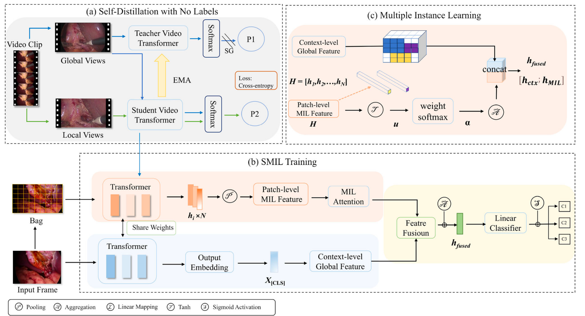

# CVS Assessment via Distillation-based Self-Supervised and Multiple Instance Learning in Laparoscopic Cholecystectomy
This is the code base for paper [CVS Assessment via Distillation-based Self-Supervised and Multiple Instance Learning in Laparoscopic Cholecystectomy](https://doi.org/10.1007/s11548-026-03580-9), which has been accepted by the International Journal of Computer Assisted Radiology and Surgery.

## Abstract

**Purpose** Accurate and automated assessment of the critical view of safety (CVS) is crucial for preventing bile duct injuries
during laparoscopic cholecystectomy (LC). Existing methods often rely on costly segmentation labels or sequential inputs,
limiting generalization and spatiotemporal understanding. This study proposes an efficient framework that removes the need
for segmentation annotations while enhancing model robustness and temporal-spatial comprehension. 

**Methods** We introduce SMIL framework, a novel framework for automated CVS assessment that combines distillation based self-supervised pretraining and multiple instance learning. A video transformer is first pretrained using label-free
self-distillation to capture rich spatiotemporal features. We conducted a benchmark evaluation on the public Endoscapes2023
dataset, comprising 201 LC videos whose CVS-relevant frames are released at 1 fps (58,813 frames in total). Train ing/validation/testing followed the official video-level split of 120/41/40 videos. It is then fine-tuned via MIL by fusing
global and local representations for multi-label CVS classification.

**Results** Experimental results on the official test partition show that SMIL framework outperforms state-of-the-art methods
without relying on segmentation labels. Compared to the strongest label-free baseline, SMIL achieves gains of 3.21% in mean
average precision and 2.74% in balanced accuracy, setting a new benchmark for automated CVS assessment without dense
annotations. Notably, SMIL also surpasses segmentation-supervised models in mAP, further highlighting its efficient learning
capability.

**Conclusion** The SMIL framework enables automated CVS assessment without segmentation annotations or sequential inputs.
By combining self-supervised and multiple instance learning, it enhances spatiotemporal understanding and generalization
in LC surgeries, offering both theoretical insights and practical value for surgical safety

## Framework
<p align="center">
  
</p>


## Install and compile the prerequisites
* Python 3.8
* PyTorch >= 1.8
* NVIDIA GPU + CUDA
* Python packages: numpy, opencv-python, scipy

## Pretrained model
Once the article is officially published, our weights will be updated accordingly.

## Main experiment
1. Modify the data path in trainlist.txt and testlist.txt to your own data path.
2. Run [python SMIL.py].

## Citation
```
@article{wang2026smil,
  title = {CVS Assessment via Distillation-based Self-Supervised and Multiple Instance Learning in Laparoscopic Cholecystectomy},
  shorttitle = {SMIL},
  author = {Hao, Wang and Yutao, Zhang and Yuxuan, Yang and Yuanbo, Zhu and Rui, Xu},
  year={2026},
  doi={10.1007/s11548-026-03580-9},
  journal = {International Journal of Computer Assisted Radiology and Surgery}
}
```